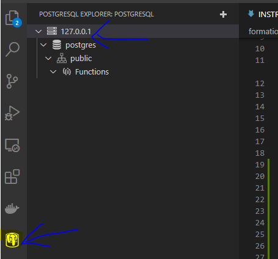
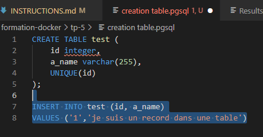
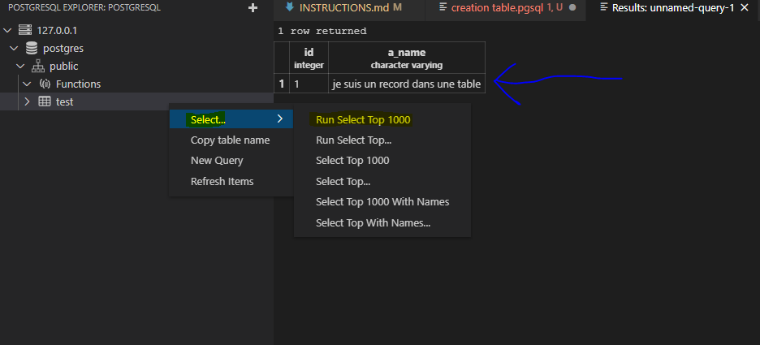

# Formation Docker - TP5

## Gestion de la persistence des données

*Pour ce TP vous n'aurez pas d'image à déposer sur votre registry docker hub*

Objectif :

Type de stockage = Volume

Persister les données d'un postgres avec un accès sur la base de donnée depuis la machine hôte pour s'y connecter et y mener des actions, tels que création de table, ajout de ligne.

Montrer que les données sont bien pérsisté dans le conteneur pour ensuite les supprimer.

Ici nous souhaitons stocker ces données sur un volume dédié.

Tips : Accéder à la base de données avec un gestionnaire de base de données (ex : dbeaver, pgadmin, extension visual studio, etc)

## RESULTATS

```
# création d'un volume dédié sur un container postgres
docker volume create data-volume

# création du container depuis l'image officielle postgres en y liant le volume
docker run -d -p 5432:5432 --name postgres -e POSTGRES_PASSWORD=postgres -v data-volume:/var/lib/postgresql/data postgres:latest
```

Sur VS code, 
1. installation du plugin PostgreSQL Explorer
2. Connexion à la base du container en utilisant localhost, le port 5432; le user postgres et son mot de passe :



3. Création d'une table de test avec insertion d'une ligne :



On peut voir dans l'afficahe du résultat que la ligne est bien insérée :



