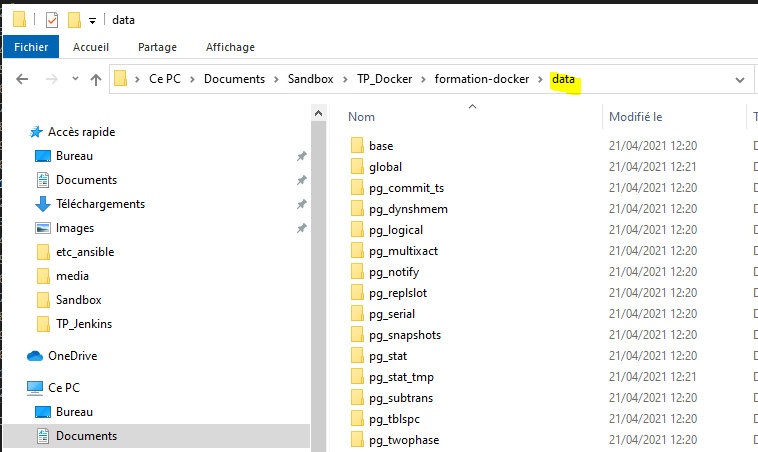

# Formation Docker - TP6

## Gestion de la persistence des données

*Pour ce TP vous n'aurez pas d'image à déposer sur votre registry docker hub*

Objectif :

Type de stockage = Bind mount

Pour la suite, référez vous au TP 5.

## RESULTATS

```
# création du container depuis l'image officielle postgres en bindant un volume (répertoire /data) sur le chemin de la base de données
docker run -d -p 5432:5432 --name postgres -e POSTGRES_PASSWORD=postgres -v ${pwd}/data:/var/lib/postgresql/data postgres:latest
```
Le reste est le même que dan le TP 5

On peut voir le dosier avec l'arborescence postgresql dans l'hote windows :


